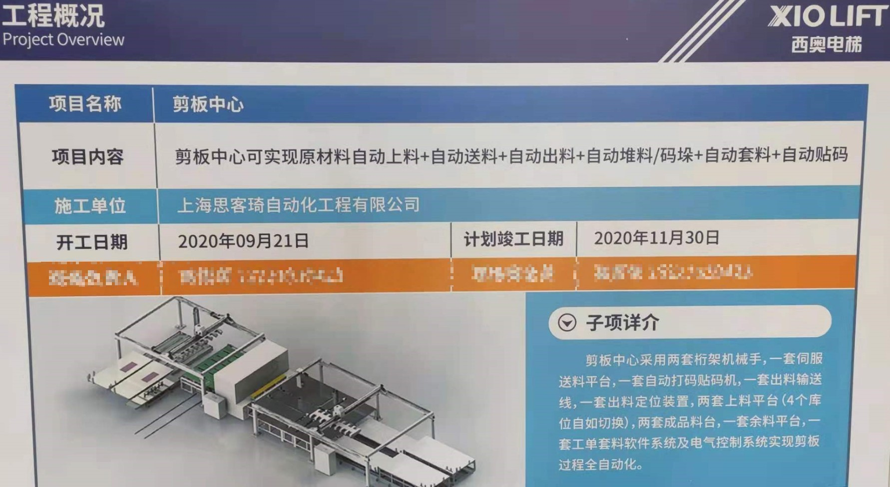
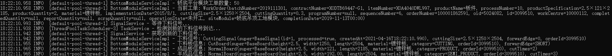
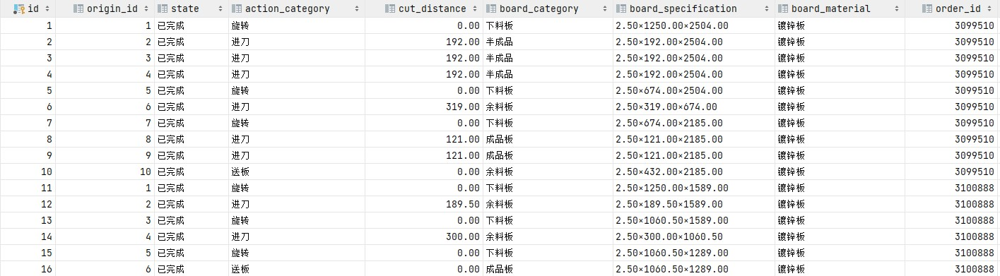
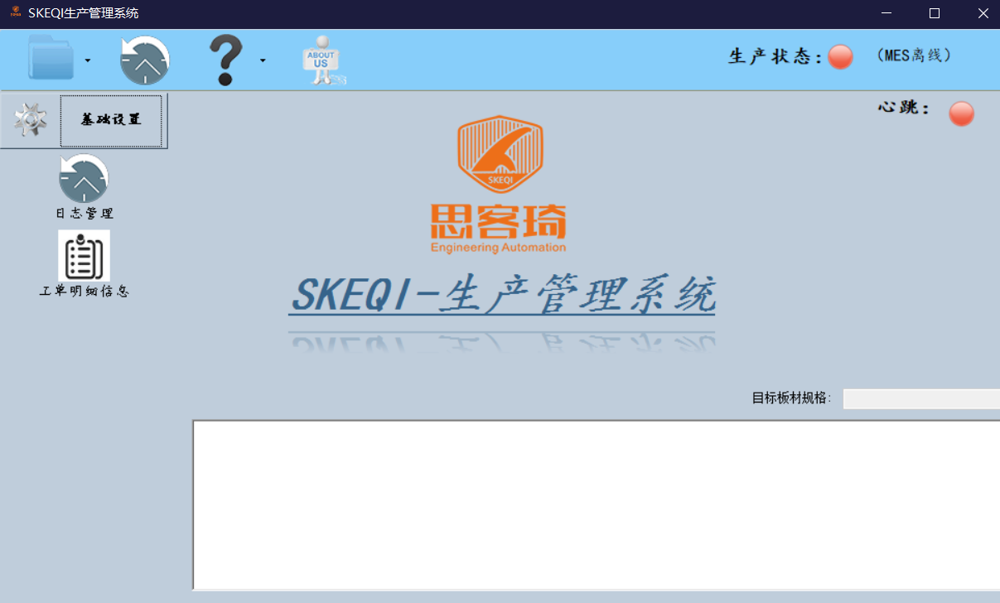
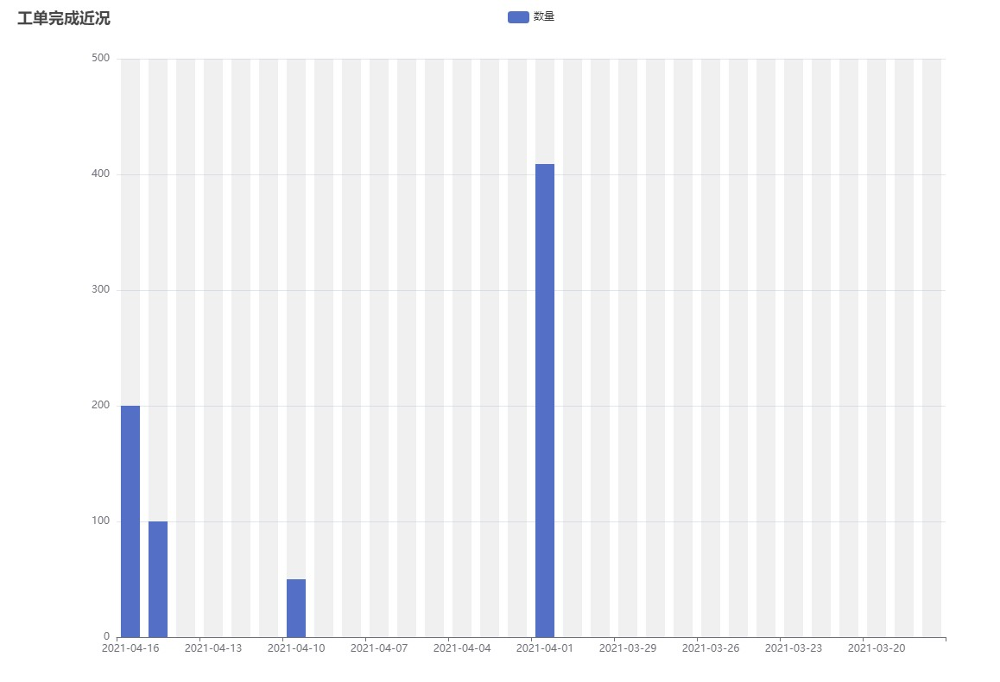

# 杭州西奥电梯剪板中心后台自动套料系统



## 工单获取与处理

员工在前台生产管理系统中设置运行参数后，系统将根据工单日期到公司生产数据库中获取工单集合至本地工单表中并通知套料系统。

套料系统启动套料主流程，根据工单模块获取部分工单集合，根据工单信息以及业务逻辑生成待裁剪板材列表，供后续机械动作生成流程使用。



## 机械动作生成与处理

机械动作生成流程将根据上述的待裁剪板材列表，生成一张原料板从上料到最后送料的所有机械动作并写入到动作数据表中。

前台生产系统会轮询动作表，一旦发现有新的未完成动作被写入，将逐一遍历动作记录并通过PLC通知电气控制系统，控制机械手进行板材自动套料。

套料系统检测到动作表动作都被处理时，将遍历动作记录，将真实完成的板材生成记录写入到对应表中，然后清空动作表，继续下一轮的动作生成。



## 工单完成情况与可视化

员工可在前台生产管理系统查看当前处理工单以及非成品板材生成情况。



访问指定页面查看近期工单完成情况。



## 异常检测与处理

后台套料系统将针对远程数据库中非标准格式成品规格进行标准化，防止处理逻辑错误以及动作无法生成等问题。

对套料主流程运行状态进行监控，一旦主流程发生错误异常结束，将记录日志并发送异常邮件给到相关工作人员邮箱，稍后重启套料主流程。

```java
public class MainService {
    public void start() {
        ThreadUtil.WORK_THREAD_RUNNING.set(true);
        try {
            this.signalService.waitingForNewProcessStartSignal();
            OperatingParameter param = this.parameterService.getLatestOperatingParameter();
            OrderModule orderModule = OrderModule.get(param.getOrderModule());
            this.moduleServiceFactory.getModuleService(orderModule.name()).processOrderList(param);
        } catch (Exception e) {
            log.error(e.getMessage(), e);
            this.mailService.sendWorkErrorMail(RUNNING_ORDER.get());
            ThreadUtil.WORK_THREAD_RUNNING.set(false);
        }
    }
}
```

```java
public class TaskService {
    @Scheduled(initialDelay = 3_000, fixedDelay = 3_000)
    public void checkMainThreadState() {
        boolean runningStatus = ThreadUtil.WORK_THREAD_RUNNING.get();
        log.info("工作流程是否正常: {}", runningStatus);
        if (!runningStatus) {
            log.info("提交新的工作任务至线程池");
            ThreadPoolFactory.getDefaultThreadPool().execute(mainService::start);
        }
    }
}
```